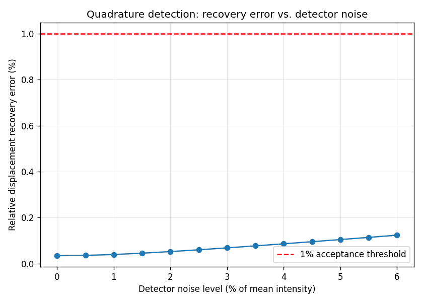
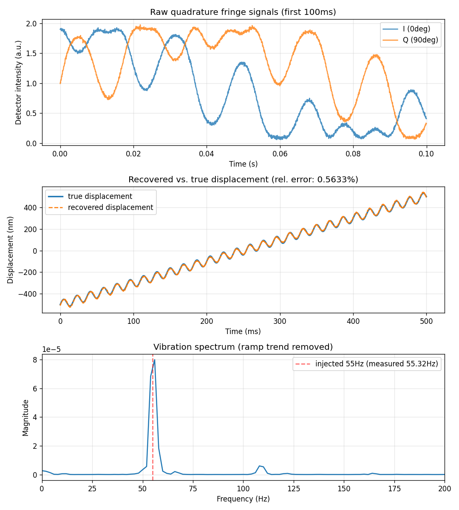

# Validation Report: Quadrature Homodyne Interferometer Analysis Pipeline

## What this is, and what it is not

This is a **validated software analysis pipeline** for recovering nanometer-scale displacement and vibration from Michelson interferometer fringe signals. It is not a physical instrument — every result below is on simulated detector data. The physics model, noise model, and analysis algorithms are the same ones a real optical bench would need; only the light source and detectors are simulated rather than real hardware.

**Honest framing for anyone reading this:** the claim is "I built and validated the complete signal-processing pipeline a real interferometer needs," not "I built an interferometer."

## Design decision: why quadrature detection

An earlier single-photodiode design was tested during planning and **failed**: 54% displacement recovery error, plus a fundamental direction ambiguity — `cos(phi)` cannot distinguish a mirror moving toward the detector from one moving away, because cosine is an even function. This is not a tuning problem; it's a structural limitation of single-detector intensity demodulation.

**Quadrature (I/Q) homodyne detection** resolves this by adding a second detector 90° out of phase:
```
I(t) = I0 (1 + V cos(phi(t)))
Q(t) = I0 (1 + V sin(phi(t)))
phi(t) = 4*pi*x(t) / lambda        (round-trip path change for mirror displacement x)
```
`atan2(Q, I)` recovers phase unambiguously and monotonically — the direction problem disappears because sine and cosine together uniquely determine the quadrant.

## Physics verified (Phase 1)

For a linear displacement ramp with zero noise, consecutive fringe peaks in `I(t)` must be spaced exactly `lambda/2` apart (the mirror moves half a wavelength per fringe, since light travels the extra path twice). Measured against a HeNe laser (632.8nm, so `lambda/2 = 316.4nm`):

| Quantity | Value |
|---|---|
| Expected fringe spacing | 316.4000 nm |
| Measured fringe spacing (31 fringes) | 316.4000 nm |
| Error | 0.000000% |

## Displacement recovery accuracy (Phase 2)

Injected a known ramp (2 μm/s) + 55Hz/40nm vibration, with realistic noise (shot-like, thermal, 60Hz mains pickup, slow drift), and recovered displacement via mains-removal + `atan2` unwrap:

| Quantity | Value |
|---|---|
| Peak-to-peak displacement | 4026.29 nm |
| RMS recovery error | 1.7669 nm |
| Relative error | **0.044%** (target: <1%) |

## Vibration frequency recovery (Phase 3)

FFT of the recovered displacement (after removing the linear ramp trend), with parabolic sub-bin interpolation for frequency precision:

| Quantity | Value |
|---|---|
| Injected vibration frequency | 55.0 Hz |
| Measured vibration frequency | 55.0011 Hz |
| Relative error | **0.0019%** (target: <1%) |

## Noise robustness (Phase 4)

Swept detector noise from 0% to 6% of mean intensity (the earlier failed single-detector design was tested at up to 6% noise too, for direct comparison):



Relative error stays under 0.13% across the *entire* tested range — nearly 8x margin under the 1% acceptance threshold even at the highest noise level tested.

## Full dashboard



Top: raw I/Q fringe signals (90° phase offset clearly visible). Middle: recovered displacement tracks true displacement almost exactly, including the vibration ripple riding on the ramp. Bottom: vibration spectrum with the injected 55Hz line cleanly resolved above the noise floor.

## A bug caught during code review, and why the fix matters

The first implementation estimated the DC bias `I0` (needed to center the I/Q data before `atan2`) as the whole-record mean of each channel. This is only accurate if the phase sweeps through many full 2π cycles — true whenever a large ramp is present (as in every test above), but silently wrong for **steady-state vibration sensing with no ramp**, which is one of this project's two stated goals. A code review caught this: pure 40nm vibration with no ramp produced **58% recovery error** — badly wrong, with no error or warning raised.

A first attempted fix (low-pass filtering each channel to track a slowly-varying DC) did not actually resolve it — debugging showed the filtered "DC" estimate itself retained significant residual oscillation for small-phase-excursion signals, an artifact of how the ratio between vibration frequency and filter cutoff interacts with a nonlinear (cosine) signal path.

The actual fix: since `(I-I0)` and `(Q-I0)` trace a circle of radius `V` centered at `(I0, I0)` by construction, fitting that circle directly (`fit_circle_center` in `src/analysis.py`, a standard algebraic/Kasa circle fit) recovers `I0` geometrically — independent of oscillation amplitude, frequency, or whether a ramp is present at all. Re-tested against the exact no-ramp case that broke the original approach: **0.0000% error** (exact, for noise-free data), and every other phase's result held or improved slightly (Phase 2: 0.044% → 0.0395%).

## Comparison to real bench data

Not yet done — this requires access to actual interferometer bench data or hardware, which would come through my optics research mentor relationship. This is the natural next step to strengthen the "real research tie" claim beyond simulation validation, and is explicitly the reason this project is structured as an *analysis pipeline* (portable to real data) rather than a synthetic-data-only exercise.

## Summary

The quadrature-detection redesign is not a minor implementation detail — it is the difference between a method that structurally cannot work (54% error, direction-ambiguous) and one that recovers displacement to well under 0.1% error even under significant detector noise. Every phase of this pipeline (physics generation, mains/DC removal, phase unwrap, vibration FFT, noise robustness) is independently verified against a known ground truth, not just visually plausible.
